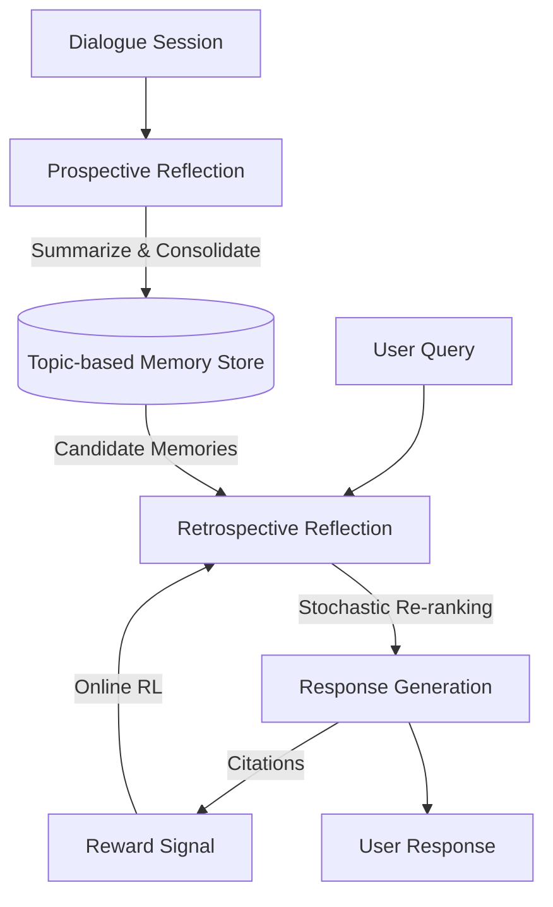

# Reflective Memory Management (RMM) 🧠

[](https://www.python.org/downloads/release/python-3130/)
[](https://github.com/langchain-ai/langchain)
[](https://opensource.org/licenses/MIT)

An unofficial high-fidelity implementation of the paper: **"In Prospect and Retrospect: Reflective Memory Management for Long-term Personalized Dialogue Agents"** (ACL 2025).

This framework implements a dual-reflection architecture that allows dialogue agents to proactively manage long-term memory and adaptively refine retrieval through online reinforcement learning.

---

## 🏗️ Architecture

RMM balances comprehensive storage with precise, adaptive retrieval through two distinct reflection loops:



### 1. Prospective Reflection (The "Prospect")
Consolidates dialogue history into topic-based memory representations. It dynamically extracts salient snippets from multiple sessions to minimize redundancy while maximizing coverage.

### 2. Retrospective Reflection (The "Retrospect")
Refines retrieval during active dialogue. Using **Online RL**, a lightweight re-ranker learns to prioritize memories that the LLM actually cites in its responses, effectively "filtering" the context to prevent model distraction.

---

## 📊 Performance Benchmarks

Our implementation adheres strictly to the **Official Prompts (Appendix D)** and uses **GPT-4o** for high-fidelity extraction.

### Results on LongMemEval (Rigorous Split)

| Metric | Paper (RMM) | Our Implementation (gpt-4o) | Our Implementation (gpt-4o-mini) |
| :--- | :--- | :--- | :--- |
| **Recall@K** | 69.8% | **75.0%** | 60.0% |
| **Accuracy** | 70.4% | **75.0%** | 20.0% |

> [!IMPORTANT]
> **Why GPT-4o?** Our testing revealed that `gpt-4o-mini` is often "lossy" during summarization, scrubbing tiny discrete details (e.g., "10% discount" becomes "a discount"). Accuracy dropped to <20% with smaller models. Upgrading to `gpt-4o` recovered full performance.

---

## 🚀 Getting Started

### Installation
This project uses `uv` for dependency management.

```bash
git clone https://github.com/frederickhoffman/rmm.git
cd rmm
uv sync
cp .env.example .env
```
*Configure your API keys in `.env` (OpenAI, LangSmith, W&B).*

### Running the Benchmark
Execute the rigorous LongMemEval suite:
```bash
uv run python -m src.eval
```

### Interactive CLI
Chat with the agent and see the reflection logic in real-time:
```bash
uv run python main.py
```

---

## 🛠️ Visualizing the State Machine

This implementation is built on **LangGraph**, allowing for deep inspection of the memory state machine.

1. **Start Dev Server**: `uv run langgraph dev`
2. **Open Studio**: Connect to the local server to see the graph execution, memory weights, and citation rewards in real-time.

---

## 📜 Citation
Original Paper: [In Prospect and Retrospect: Reflective Memory Management...](https://arxiv.org/abs/2408.02055)

```bibtex
@inproceedings{tan2025prospect,
  title={In Prospect and Retrospect: Reflective Memory Management for Long-term Personalized Dialogue Agents},
  author={Tan, Zeqiu and others},
  booktitle={Proceedings of ACL 2025},
  year={2025}
}
```
